# Evolving a Tetris Player with a Genetic Algorithm

**Netanel Damlash**

Research project · Topics in Applications of Computer Science (Prof. Moshe Sipper)

<p align="center">
  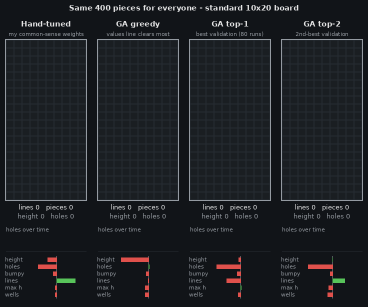
</p>
<p align="center"><em>Four players get exactly the same 400 pieces. Left: my hand-tuned weights. Right: three players found by the
genetic algorithm. Under each board: lines, stack height, holes, a "holes over time" chart and the player's six raw weights
(green = reward, red = penalty). Raw weights can be misleading, because one feature is redundant (Section 2.2): GA greedy's
"lines" bar is almost empty, but it is the player that values line clears the most. Watch the counters: GA top-2 (far right)
keeps the lowest and cleanest board. One game is only an illustration; Section 4.5 measures the playing styles over many
games.</em></p>

**Summary.** In this project a Tetris player picks every move with a weighted sum of six board features, and a
genetic algorithm (GA) searches for the six weights. I trained the players on a small 10×10 board and tested them on
new games, both on the small board and on the standard 10×20 board. Every GA setting was run 10 times (8 settings,
80 runs). The best evolved players cleared a median of **4.5× and 22× more lines** than my own hand-tuned player on
the standard board (*p* < 0.001), but a typical single GA run only reached the level of the hand-tuned player. A bigger
population helped, mostly because it plays more games. The mutation rate and the choice of selection and crossover
changed how diverse the population stayed, but not how good the final player was. Weights learned on the small board
worked on the big board too, and the differences between the players became larger there. When I looked inside the
evolved weights, I found that the best players almost do not reward clearing lines: they avoid holes and keep the
board low and smooth, and the line clears come by themselves.

### Contents

1. [Introduction](#1-introduction)
2. [Methods](#2-methods)
3. [Experiment design](#3-experiment-design)
4. [Results](#4-results)
5. [Conclusions](#5-conclusions)
6. [References](#references) · [Code structure and how to run](#code-structure-and-how-to-run)

---

## 1. Introduction

Tetris looks like a simple game. Pieces of seven shapes fall one after the other into a well that is 10 cells wide,
and for every piece the player only decides on a rotation and a column. When a row is completely full it disappears
(a "cleared line"), and the game is over when the stack reaches the top. What makes it hard is that the next pieces
are random and unknown, so every move has to be good enough for whatever comes next. Even the version where the whole
sequence of pieces is known in advance is computationally hard (Breukelaar et al., 2004).

Most Tetris programs are built around an **evaluation function**. For every possible placement of the current piece,
the program computes a few numbers about the board that the placement would leave (how high the stack is, how many
holes there are, and so on), multiplies them by weights, adds them up, and plays the placement with the best score.
Such a player is only as good as its weights. I can guess reasonable weights by hand, but a guess is just a guess.
Searching for the weights is a good fit for evolutionary algorithms: the only way to measure a weight vector is to let
it play, the result changes a lot from game to game, and there is no gradient to follow. Genetic algorithms and
similar methods have been used for this before (Böhm et al., 2005; Szita & Lőrincz, 2006; Thiery & Scherrer, 2009;
Lee, 2013).

In my project the player is intentionally simple: six features, and it only sees the current piece. Because the player
itself is simple, I put most of the work into the experiments and the analysis. I wanted to find out what a standard GA
can do with such a player, which GA settings really matter, and what the evolved players learn, not only how many
lines they clear. I also made animations of the players, so it is possible to see how they play and not just their
scores.

### Research questions

| # | Question | Hypothesis (before the experiments) |
|---|---|---|
| **RQ1** | Does a GA-evolved player clear more lines than a random player and a hand-tuned player? | Yes, at least 2× the hand-tuned player. |
| **RQ2** | How do population size and mutation rate affect the final player and the speed of convergence? | A population of ~50 and a mutation rate of ~0.05 give the best result per unit of computation. |
| **RQ3** | Tournament or roulette selection, uniform or arithmetic crossover: which works better? | Tournament selection with arithmetic crossover converges fastest. |
| **RQ4** | Do weights evolved on a small 10×10 board still work on the standard 10×20 board? | Yes, most of the performance is kept. |

---

## 2. Methods

### 2.1 The game

I wrote a headless Tetris engine ([`tetris/engine.py`](tetris/engine.py)) in Python with NumPy:

* The board is 10 columns wide; its height is configurable (10 rows for training, 20 rows = the standard board).
* The 7 standard pieces (I, O, T, S, Z, J, L) are drawn uniformly at random from a **seeded** random generator, so
  the same seed gives every player exactly the same piece sequence.
* A move is a (rotation, column) pair, and the piece is dropped straight down ("hard drop"), as is usual in Tetris
  AI research. There is no "hold" and no preview of the next piece.
* Full rows are cleared. The game ends when the current piece cannot be placed anywhere, or when an optional piece
  cap is reached.
* The score of a game is the **number of lines cleared**.

The engine is covered by unit tests (drops, rotations, line clears, game over; [`tests/`](tests/)).

### 2.2 The player: a linear evaluation function

For every legal placement of the current piece, the player ([`tetris/agent.py`](tetris/agent.py)) computes six
features of the board *after* the placement ([`tetris/features.py`](tetris/features.py)):

| Feature | Definition |
|---|---|
| aggregate height | sum of the 10 column heights |
| holes | empty cells that have a filled cell somewhere above them |
| bumpiness | sum of height differences between neighbouring columns |
| lines | number of lines this placement clears |
| max height | height of the tallest column |
| wells | total depth of "wells" (columns lower than both neighbours; the walls count as tall) |

and gives the placement the score

$$\text{score} = w_1\cdot\text{height} + w_2\cdot\text{holes} + w_3\cdot\text{bumpiness} + w_4\cdot\text{lines} + w_5\cdot\text{max height} + w_6\cdot\text{wells}.$$

It plays the placement with the highest score. So the weight vector **w = (w₁, …, w₆)** *is* the player: it is the
"DNA" that the GA evolves.

**One feature is redundant.** While building the feature code I noticed that "holes" carries no extra information
when "aggregate height" and "lines" are also features. Every cell below a column top is either filled or a hole, so
holes = aggregate height − filled cells. A piece adds 4 cells and every cleared line removes 10, so for all candidate
placements of the same piece, *holes = aggregate height + 10·lines + constant*. Therefore

$$w_1\cdot\text{height} + w_2\cdot\text{holes} + w_4\cdot\text{lines} = (w_1+w_2)\cdot\text{height} + (w_4+10\,w_2)\cdot\text{lines} + \text{constant},$$

and the player ranks the moves exactly as a player with only five weights would (a unit test checks this on every
move of several games). Two consequences: very different-looking weight vectors can be the *same* player, and the raw
weights cannot be read one by one. In the analysis (Section 4.5) I therefore convert every weight vector into
**effective weights**, measured in "cells of stack height". The most useful one is the **line value**: the total net
reward for clearing one line, counting the ~10 cells of stack height that the clear removes. A player that only
minimises the stack height has a line value of 10; a line value near 0 means that a clear is neither rewarded nor
punished, so the player judges a move only by the shape of the board it leaves (holes, smoothness, wells).

### 2.3 The genetic algorithm

The GA ([`ga/evolution.py`](ga/evolution.py), [`ga/operators.py`](ga/operators.py)) works on real-valued vectors:

* **Representation.** An individual is a vector of 6 weights scaled to length 1. Multiplying all weights by the same
  positive number does not change which move wins, so only the *direction* matters; normalising removes this
  redundancy (Lee, 2013 uses the same idea).
* **Initial population.** Random directions (each weight drawn from a normal distribution, then normalised).
* **Fitness.** The mean number of lines cleared in 3 training games. The whole population plays the same 3 games in a
  generation (a fair comparison), and new games are drawn every generation (so nobody over-fits one piece sequence).
* **Selection.** Tournament selection (best of 3 random individuals) or roulette-wheel selection (probability
  proportional to fitness).
* **Crossover.** Arithmetic (child = *a*·parent₁ + (1−*a*)·parent₂ with random *a* ∈ [0, 1]) or uniform (each weight
  copied from a random parent). Every child is produced by crossover and then mutation.
* **Mutation.** Each weight is changed with probability *mutation rate* by adding Gaussian noise (σ = 0.2); the vector
  is then normalised again.
* **Elitism.** The 2 best individuals are copied unchanged to the next generation.
* **Validation-based champion.** Three training games are a very noisy measurement: in early tests, the top
  individual of the last generation was often just lucky. So in every generation the 3 best individuals also play
  **10 fixed validation games**, and the individual with the best validation score over the whole run becomes the
  run's **champion**. Only champions are tested and reported.

Default settings ([`experiments/configs/default.yaml`](experiments/configs/default.yaml)):

| population | generations | training games / individual | selection | crossover | mutation rate | σ | elitism | validation |
|---|---|---|---|---|---|---|---|---|
| 50 | 50 | 3 (10×10 board, ≤ 1,000 pieces) | tournament (k = 3) | arithmetic | 0.05 per weight | 0.2 | 2 | top 3 × 10 games |

### 2.4 Baseline players

| Player | Weights (height, holes, bumpiness, lines, max height, wells) | Where it comes from |
|---|---|---|
| Random | — | picks a random legal placement |
| Hand-tuned | (−0.5, −1.0, −0.2, 1.0, −0.1, −0.1) | my own common-sense guess, fixed before any experiment |
| Literature | (−0.51, −0.36, −0.18, 0.76, 0, 0) | weights published by Lee (2013), found with a GA for a player that also sees the next piece |

### 2.5 Why train on a 10×10 board

My first plan was to train on the standard 10×20 board with a cap of 500 pieces per game. A quick check showed that
this cannot work: 500 pieces are 2,000 cells, so at most 200 lines can be cleared, and the hand-tuned player already
clears **175–198 lines (mean 194)** in every one of 20 test games
([`results/tables/design_checks.md`](results/tables/design_checks.md)). Fitness saturates and the GA has nothing to
improve. On a 10×10 board even good players lose within a few hundred pieces, so lines cleared keep separating good
players from bad ones, and games are short. This also turned RQ4 into a real question: *train small, test big*.

---

## 3. Experiment design

All experiments are described by YAML files in [`experiments/configs/`](experiments/configs/) and run with
`experiments/run.py`.

| Exp. | RQ | What varies | GA runs | Evaluation |
|---|---|---|---|---|
| **E1** | RQ1 | random, hand-tuned, literature, and GA champions of the default setting | 10 (default) | 20 test games, 10×10, no piece cap |
| **E2** | RQ2 | population size 20 / **50** / 100 | 3 × 10 | each champion: 20 test games, 10×10 |
| **E3** | RQ2 | mutation rate 0.01 / **0.05** / 0.15 (per weight) | 3 × 10 | same |
| **E4** | RQ3 | {tournament, roulette} selection × {**arithmetic**, uniform} crossover | 4 × 10 | same |
| **E5** | RQ4 (+RQ1) | the E1 players plus the 3 champions with the best *validation* score of all 80 runs | — | 20 test games, **10×20**, cap 250,000 pieces |

(**Bold** = default value. The default setting appears in E2, E3 and E4 but was run only once, so there are 8
settings × 10 runs = **80 GA runs**.)

**Seeds and fairness.**
* Training, validation and test games use three separate ranges of piece seeds, so a champion is never tested on a
  game it has seen.
* All players are tested on the **same 20 test games**, so player comparisons are *paired*.
* GA run number *k* uses the same random seed in every setting, so run *k* of every setting starts from the same
  initial population (population 20 uses the first 20 of those individuals, population 100 adds 50 more) and plays
  the same training games; comparisons between settings are paired by run.

**Choosing "the GA player" without cheating.** Picking the champion with the best *test* score would be biased. In E1
the "GA best" player is the default-setting champion with the best *validation* score; in E5 the "top-1/2/3" players
are the three best validation scores of all 80 runs. Test games were never used for any choice.

**Metrics.** Lines cleared per test game; champion validation score; population mean fitness; *diversity* (mean
distance of the individuals from the population's average vector; about 1 for a random population and 0 when
everybody is identical); generations needed to reach 90% of the final champion score; run time.

**Statistics.** Lines per game are very skewed (most games are short, a few are very long), so I report medians and
box plots next to means, and use non-parametric tests: the paired **Wilcoxon** signed-rank test for two players on the
same games, **Mann–Whitney U** for two groups of runs, **Kruskal–Wallis** for 3–4 settings, **Holm** correction when
several comparisons are made at once, and the **Vargha–Delaney A12** effect size (the probability that the first
player beats the second in a random game pair; 0.5 = no difference, ≥ 0.71 is usually called large). Significance
level 0.05.

**Computation.** The 80 GA runs took about 5.7 hours on a 2-core machine with two worker processes (2.2 minutes for a
population-20 run, 8.3 minutes for population 100). All evaluations together (2,220 test games) took about 6 minutes.

**Reproducibility.** Everything is seeded. Re-running a GA run and all evaluations from a fresh clone of this
repository gave bit-for-bit identical results (only the timing columns differ). Every table and figure in this report
is produced by a script: [`experiments/stats.py`](experiments/stats.py) (tables),
[`experiments/plots.py`](experiments/plots.py) (figures) and [`experiments/animate.py`](experiments/animate.py)
(animations).

---

## 4. Results

### 4.1 RQ1: Do evolved players beat random and hand-tuned players?

<p align="center">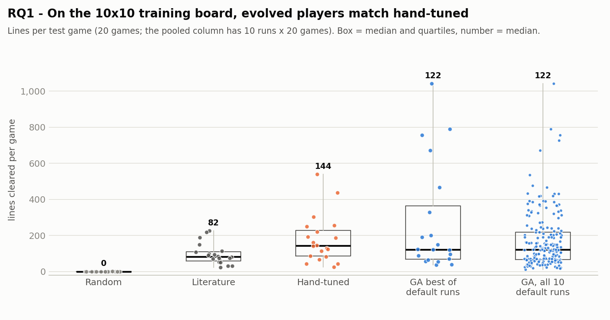</p>

*Figure 1: Lines per test game on the 10×10 training board (E1). Box = quartiles, dots = single games,
number = median. "GA, all 10 default runs" pools the 10 champions × 20 games.*

| Player (10×10, 20 test games) | mean | median | games won vs. hand-tuned | *p* vs. hand-tuned (Holm) | A12 |
|---|---|---|---|---|---|
| Random | 0.1 | 0 | 0/20 | < 0.001 | 0.00 |
| Literature | 96.1 | 82.5 | 6/20 | 0.041 | 0.29 |
| Hand-tuned | 177.3 | 143.5 | — | — | — |
| GA best of the 10 default runs (by validation) | 273.3 | 122.5 | 9/20 | 1.000 | 0.51 |
| GA, all 10 default runs (200 games) | 172.3 | 122.5 | — | 1.000 | 0.46 |

On the training board every player is far better than random. The literature weights (tuned by Lee (2013) for a
player that also sees the next piece) are significantly *worse* than my hand-tuned ones in this one-piece setting.
But the GA champions only **match** the hand-tuned player: the best default-setting champion has a higher mean (273
vs. 177, pulled up by a few very long games) but a lower median, and it wins 9 of 20 games (A12 = 0.51, no
difference).

<p align="center">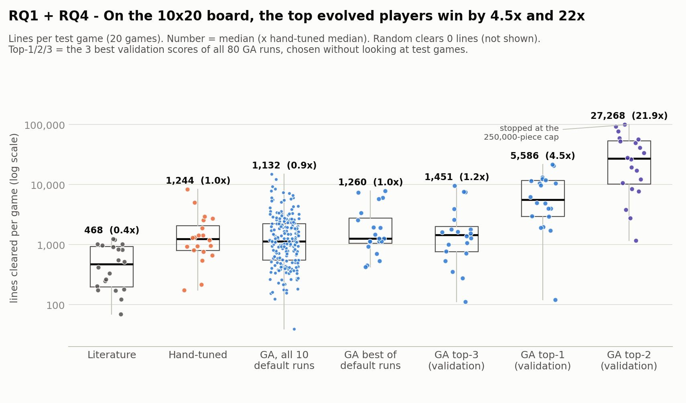</p>

*Figure 2: Lines per test game on the standard 10×20 board (E5), log scale. Number = median and, in brackets, the
ratio to the hand-tuned median. Random clears 0 lines and is not shown.*

| Player (10×20, 20 test games) | mean | median | median / hand | games won vs. hand | *p* (Holm) | A12 |
|---|---|---|---|---|---|---|
| Literature | 563 | 468 | 0.4× | 2/20 | < 0.001 | 0.20 |
| Hand-tuned | 1,805 | 1,244 | 1.0× | — | — | — |
| GA, all 10 default runs (pooled) | 1,792 | 1,132 | 0.9× | — | 1.000 | 0.48 |
| GA best of the default runs | 2,413 | 1,260 | 1.0× | 11/20 | 1.000 | 0.56 |
| GA top-3 (validation) | 2,350 | 1,451 | 1.2× | 11/20 | 1.000 | 0.54 |
| **GA top-1** (validation) | 7,871 | 5,586 | **4.5×** | 18/20 | < 0.001 | 0.88 |
| **GA top-2** (validation) | 35,072* | 27,268 | **21.9×** | 19/20 | < 0.001 | 0.96 |

\* One game of GA top-2 reached the 250,000-piece safety cap (at 99,995 lines), so its mean is a lower bound.

On the standard board the picture changes. Two of the three champions with the best validation scores (chosen
without looking at any test game) clear **4.5× and 22× more lines** than the hand-tuned player (median) and win 18
and 19 of the 20 games. A typical single run is still only as good as the hand-tuned player.

**Answer to RQ1.** Evolved players are always far better than random. Against the hand-tuned player the hypothesis
(≥ 2×) holds only for the best evolved players, and only on the standard board: whether *one* GA run finds such a
player is a matter of luck, but running the GA several times and keeping the best-*validated* champions works.

### 4.2 RQ2: Population size and mutation rate

<p align="center">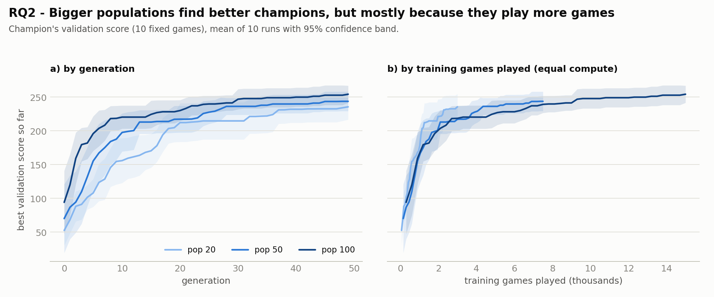</p>

*Figure 3: Best validation score so far, mean of 10 runs with 95% confidence band. (a) by generation, (b) by the
number of training games played, i.e. by computation.*

<p align="center">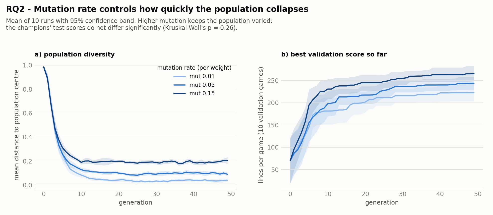</p>

*Figure 4: Mutation rate: (a) population diversity, (b) best validation score so far (mean of 10 runs, 95% band).*

| Setting (10 runs each) | champion test mean (avg. of runs) | champion validation | population mean fitness, last 10 gens | generations to 90% | diversity, gens 25–49 | minutes / run |
|---|---|---|---|---|---|---|
| population 20 | 149.5 | 235.6 | 149.8 | 21.6 | 0.09 | 2.2 |
| population 50 (default) | 172.3 | 243.8 | 144.2 | 16.4 | 0.10 | 3.5 |
| population 100 | 187.6 | 254.3 | 148.8 | 14.0 | 0.10 | 8.3 |
| mutation 0.01 | 171.2 | 222.3 | 151.0 | 18.3 | **0.04** | 3.5 |
| mutation 0.05 (default) | 172.3 | 243.8 | 144.2 | 16.4 | 0.10 | 3.5 |
| mutation 0.15 | 207.6 | 265.4 | 141.8 | 16.3 | **0.19** | 3.6 |

**Population size.** Bigger populations produce better champions (Kruskal–Wallis *p* = 0.022): population 100 beats
population 20 (test mean 187.6 vs. 149.5, A12 = 0.83, Mann–Whitney *p* = 0.013, Holm 0.038; paired Wilcoxon
*p* = 0.010), while neighbouring sizes are not significantly different with 10 runs. Two observations explain *why*:

* The **average** individual does not get better with a bigger population (last-10-generation mean fitness 144–150
  for all sizes, *p* = 0.45). A bigger population helps because it *samples more candidates* and so finds a better
  best one.
* At **equal computation** the advantage disappears (Figure 3b): after 3,000 training games the average champion
  validation score is 235.6 (population 20), 217.2 (50) and 218.6 (100); after 7,500 games 243.8 (50) vs. 239.2
  (100). Population 100 wins mainly because it plays 2× more games than population 50.

Bigger populations also tend to converge in fewer generations (21.6 → 16.4 → 14.0 generations to 90%), but this is
not significant (*p* = 0.32).

**Mutation rate.** The mutation rate controls the population's **diversity** very strongly (*p* < 0.001, Figure
4a): with 0.01 the population collapses into near-copies of one individual by generation 20 (diversity 0.04), while
with 0.15 it stays varied for the whole run (0.19). More diversity finds champions with higher *validation* scores
(222 → 244 → 265, *p* = 0.008; 0.15 vs. 0.01 *p* = 0.006), but their **test** scores do not differ significantly
(*p* = 0.26). The higher test mean of mutation 0.15 comes mostly from one exceptional run (run 2, test mean 442,
which became the "GA top-2" player). The cost of exploring is small: the population mean is slightly lower with more
mutation (151 → 144 → 142, not significant).

**Answer to RQ2.** Population size matters for the final player, but mostly as "more computation"; per training game,
population 20–100 are about equal, so 50 is a reasonable trade-off (hypothesis partly supported). Mutation rate
mainly changes diversity; 0.05 is not better than 0.01 or 0.15 (hypothesis not supported). If anything, 0.15 found
better-validated champions and the best single player, at no extra cost.

### 4.3 RQ3: Selection and crossover operators

<p align="center">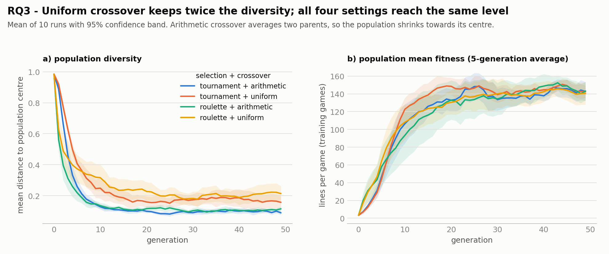</p>

*Figure 5: Selection × crossover: (a) population diversity, (b) population mean fitness (5-generation moving
average). Mean of 10 runs with 95% band.*

| Setting (10 runs each) | champion test mean | champion validation | population mean, last 10 gens | generations to 90% | diversity, gens 25–49 |
|---|---|---|---|---|---|
| tournament + arithmetic (default) | 172.3 | 243.8 | 144.2 | 16.4 | 0.10 |
| tournament + uniform | 165.2 | 253.7 | 146.6 | 18.1 | 0.17 |
| roulette + arithmetic | 186.5 | 254.6 | 146.0 | 23.9 | 0.11 |
| roulette + uniform | 164.9 | 256.2 | 142.8 | 15.7 | 0.20 |

None of the performance measures differ significantly between the four combinations (Kruskal–Wallis: champion test
score *p* = 0.68, validation *p* = 0.68, population mean *p* = 0.79, generations to 90% *p* = 0.35). All four end at the
same level: a population mean of 143–147 lines per game over the last 10 generations (Figure 5b).

What *does* change is diversity (*p* < 0.001): **uniform crossover keeps about twice as much diversity** as
arithmetic crossover (0.17–0.20 vs. 0.10–0.11). The reason is visible in the operators: arithmetic crossover
*averages* two parents, so every child lies between them and the population shrinks towards its centre; uniform
crossover copies whole genes and keeps unusual combinations alive. The selection method hardly affects diversity.

<p align="center">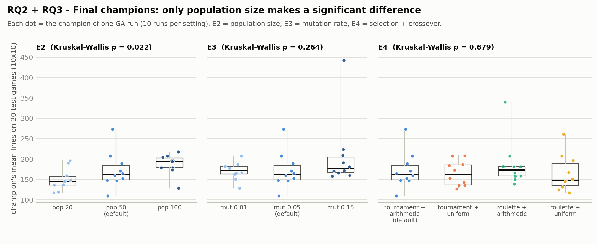</p>

*Figure 6: The final champions of all 80 runs (one dot per run) on the 20 test games, for every setting of E2, E3
and E4. Only population size gives a significant difference.*

**Answer to RQ3.** The hypothesis is not supported: no combination of selection and crossover is significantly better
or faster. On this problem the operators change *how* the population searches (diversity), not the quality of the
result.

### 4.4 RQ4: From the 10×10 board to the 10×20 board

<p align="center">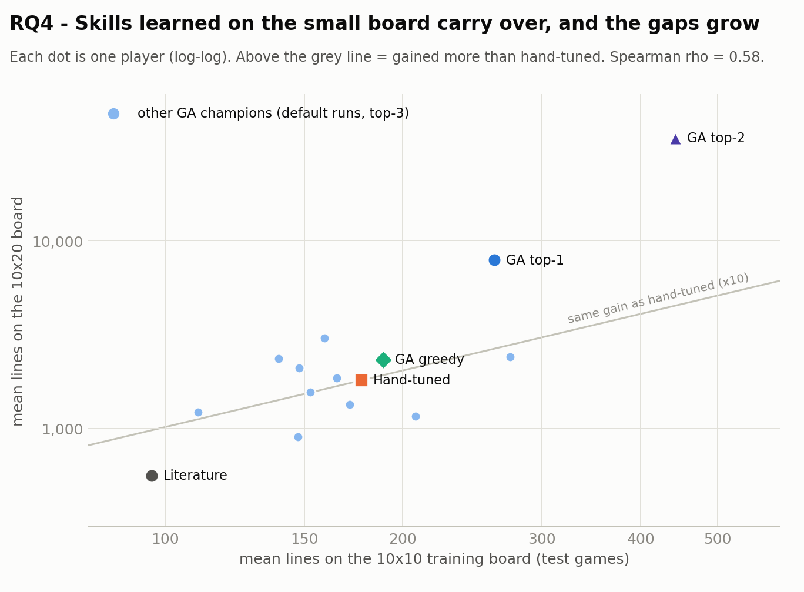</p>

*Figure 7: Every player tested on both boards (log–log). Points above the grey line gained more from the taller
board than the hand-tuned player did.*

| Player | 10×10 mean | 10×20 mean | gain (10×20 / 10×10) | vs. hand-tuned on 10×10 | vs. hand-tuned on 10×20 |
|---|---|---|---|---|---|
| GA top-2 | 442.1 | 35,072 | 79× | 2.5× | 19.4× |
| GA top-1 | 261.1 | 7,871 | 30× | 1.5× | 4.4× |
| Hand-tuned | 177.3 | 1,805 | 10× | 1.0× | 1.0× |
| Literature | 96.1 | 563 | 6× | 0.5× | 0.3× |
| the 10 default champions | 110–273 | 906–3,027 | 6–19× | 0.6–1.5× | 0.5–1.7× |

Every one of the 15 players clears many more lines on the standard board (5.6× to 79× more), and the ranking is
partly preserved (Spearman ρ = 0.58, *p* = 0.024, for means). The most interesting part is that the **differences
grow**: GA top-2 is 2.5× better than the hand-tuned player on the small board but about 20× better on the big one. I
think the reason is that every extra row of free space gives a careful player more room to recover from bad pieces,
so a small advantage per move (keeping the board clean) adds up to a much longer game. The correlation is not perfect,
though: the default champion with the best small-board mean (run 8, 273 lines) gained less than the hand-tuned player
(8.8× vs. 10×). Its high mean on 10×10 came from a few very long games (its median was only 122.5).

**Answer to RQ4.** Yes. The skill learned on the small board carries over (hypothesis supported), and good players
become *relatively* better on the standard board. Training on a small board was cheap and did not hurt.

### 4.5 What did evolution learn? Weights and playing styles

Different runs ended with weight vectors that look very different (Figure 8a), and because of the holes redundancy
(Section 2.2) raw weights are misleading. For example, GA top-1 has a **negative** raw weight for "lines" (−0.50), yet it
clears lines normally: a clear also lowers the stack, and once the redundant holes weight is folded in, its net line
value is still slightly positive (0.37). This is why I look at the effective weights instead.
For the style comparison I picked four players by fixed rules: the hand-tuned player, **GA top-1** and **GA top-2**
(the two best validation scores of all runs), and **GA greedy** (the default-setting champion with the highest line
value).

<p align="center">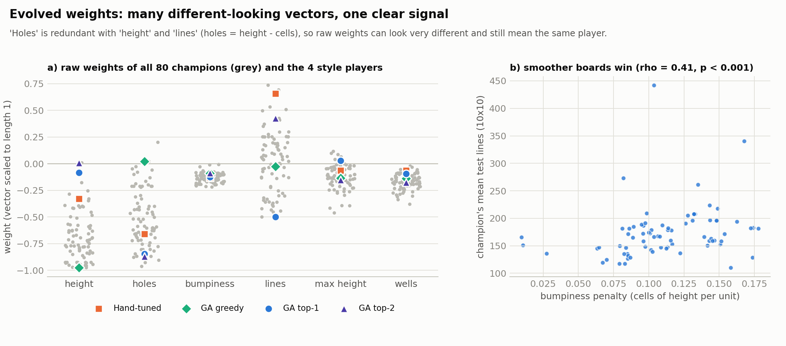</p>

*Figure 8: (a) Raw weights of all 80 champions (grey) and of the four style players. (b) Effective bumpiness penalty
vs. the champion's test score.*

<p align="center">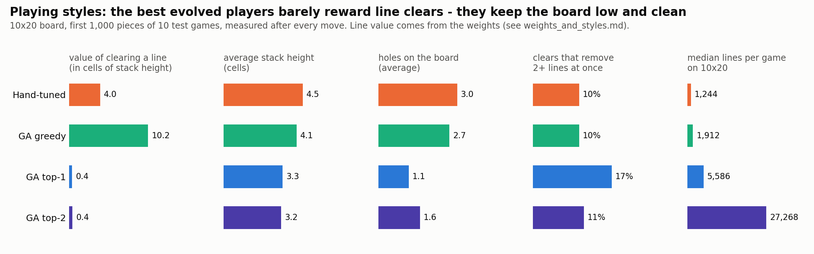</p>

*Figure 9: How the four players play on the 10×20 board (first 1,000 pieces of 10 test games, measured after every
move), next to their line value.*

| Player | line value (cells of height) | avg. stack height | holes | clears of 2+ lines | median lines on 10×20 |
|---|---|---|---|---|---|
| Hand-tuned | 4.0 | 4.46 | 2.97 | 10% | 1,244 |
| GA greedy | **10.2** | 4.12 | 2.68 | 10% | 1,912 |
| GA top-1 | **0.37** | 3.32 | **1.15** | 17% | 5,586 |
| GA top-2 | **0.41** | 3.24 | 1.57 | 11% | 27,268 |

What I found:

1. **The best players barely reward clearing lines.** For GA top-1 and top-2 a cleared line is worth only ~0.4 cells
   of stack height in total, so they are almost indifferent to clearing; their weights are dominated by the holes
   penalty (raw −0.85 and −0.87). The hand-tuned player values a clear at 4 cells and GA greedy at 10 (GA greedy is
   practically a pure height minimiser: its raw holes and lines weights are close to 0). Yet the best players are the
   ones that keep the board **low and clean** (stack ~1.2 cells lower, about half the holes); on a clean board the
   clears happen by themselves. All four clear about 0.4 lines per piece, which is simply what any player that
   survives must do (4 cells per piece ÷ 10 cells per line).
2. **Smoothness separates good champions from average ones.** Over all 80 champions, the only effective weight
   that correlates significantly with the test score is the **bumpiness penalty** (Spearman ρ = 0.41, Holm
   *p* < 0.001, Figure 8b); line value, max-height and wells weights do not.
3. **Different weights, similar results.** Champions of different runs look very different (Figure 8a) but mostly reach
   similar scores. In 6 of the 8 settings, run 5 even kept the same random *generation-0* individual as its champion,
   because nothing found later beat it on validation. This fits the picture of a fitness landscape with a broad
   plateau for this simple six-feature player.

The animations show the same thing in motion. Each one is a single test game (the first test seed, fixed in advance
and not picked by me), so it is an illustration and not a statistic:

<p align="center">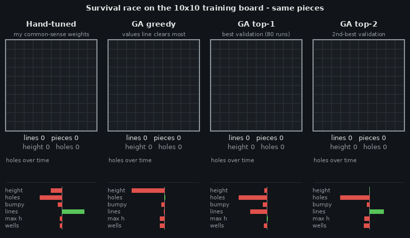</p>

*Survival race on the 10×10 training board, same pieces for all four players. In this game the hand-tuned and greedy
players lose after ~230 pieces, GA top-1 after 621 pieces (240 lines) and GA top-2 after 1,981 pieces (784 lines).*

<p align="center">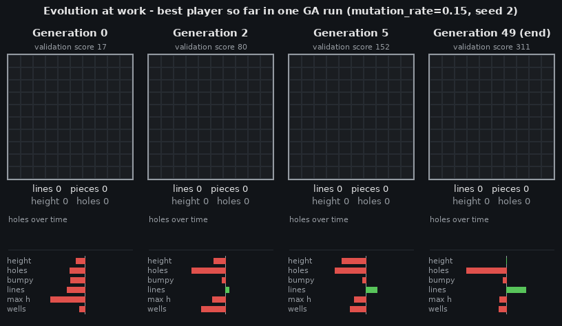</p>

*One GA run step by step: the best player found so far in the run with mutation 0.15, run 2 (the run that produced
GA top-2), after generations 0, 2, 5 and 49, on the same test game. Validation scores 17 → 80 → 152 → 311.*

---

## 5. Conclusions

**Answers to the research questions:**
* **RQ1:** The evolved players are much better than random. A typical GA run gives a player about as good as my
  hand-tuned one, but the best-validated players from all the runs are **4.5× and 22× better** (median) on the
  standard board. So my hypothesis (at least 2×) is true only for the best players, and only on the big board.
* **RQ2:** A bigger population gave better champions, but mostly because it played more games. The mutation rate
  changed the diversity of the population a lot, but it did not change the final player significantly.
* **RQ3:** Selection and crossover did not change the result or the speed. Uniform crossover kept about twice as
  much diversity.
* **RQ4:** Weights evolved on the 10×10 board also work on the 10×20 board, and the differences between the players
  become bigger there.

**What I learned:**
* With almost every setting, the GA reached about the same level with this six-feature player. The only significant
  difference was population 20 vs. 100, and that was mostly a matter of more computation. The settings mainly changed
  *how* the GA got there (diversity, speed, how consistent the runs were). I think this means that the features, and
  not the GA, are what limits the player.
* The fitness is very noisy, so the way the final player is chosen turned out to be almost as important as the search
  itself. At first I simply took the best individual of the last generation, and it was often just lucky. Adding
  validation games and running the GA many times fixed most of this. Even so, the champions' validation scores were
  higher than their test scores in 96% of the runs (the "winner's curse": the maximum of noisy measurements is usually
  too optimistic). Only the best-validated champions over all runs were clearly better than my hand-tuned player.
* The part I found most interesting was looking inside the weights. I did not expect one of my six features
  ("holes") to be completely redundant, and I also did not expect that the best players would almost ignore line
  clears and win by avoiding holes and keeping the board smooth.

**Limitations:**
* The player sees only the current piece and uses six features that I chose. Stronger Tetris players use more
  features and also look at the next piece.
* I did not compare the GA with plain random search using the same number of training games. In 6 of the 80 runs
  the champion was a random individual from generation 0 (Section 4.5), so such a comparison would show how much the
  GA itself adds.
* With 10 runs per setting the tests have low power, so some differences (for example population 50 vs. 100, or
  mutation 0.15 vs. 0.05) might be real but too small to detect.
* The scores are heavy-tailed, and one 10×20 game of GA top-2 reached the 250,000-piece cap, so its mean is
  underestimated.
* Each individual played only 3 training games per generation, which is noisy. The validation games reduce the
  winner's curse but do not remove it.
* The animations show single games and are only illustrations.

**Future work:** The next thing I would try is a richer player: more features (for example row and column
transitions) and looking at the next piece as well. It would also be interesting to compare the GA with other
optimisers such as the cross-entropy method (Szita & Lőrincz, 2006), to give each individual more games or use a
selection method that takes the noise into account, and to check whether a fitness that directly rewards a smooth, low
board makes evolution faster.

---

## References

* Böhm, N., Kókai, G., & Mandl, S. (2005). An evolutionary approach to Tetris. *Proceedings of the 6th Metaheuristics
  International Conference (MIC 2005)*, Vienna.
* Breukelaar, R., Demaine, E. D., Hohenberger, S., Hoogeboom, H. J., Kosters, W. A., & Liben-Nowell, D. (2004). Tetris
  is hard, even to approximate. *International Journal of Computational Geometry & Applications*, 14(1–2), 41–68.
* Lee, Y. (2013). *Tetris AI – The (Near) Perfect Bot.*
  <https://codemyroad.wordpress.com/2013/04/14/tetris-ai-the-near-perfect-player/>
* Szita, I., & Lőrincz, A. (2006). Learning Tetris using the noisy cross-entropy method. *Neural Computation*, 18(12),
  2936–2941.
* Thiery, C., & Scherrer, B. (2009). Building controllers for Tetris. *ICGA Journal*, 32(1), 3–11.

---

## Code structure and how to run

```
tetris/       engine.py (game), features.py (6 features), agent.py (linear player), baselines.py
ga/           operators.py (selection / crossover / mutation), evolution.py (the GA)
experiments/  configs/*.yaml (one file per experiment), run.py (runner),
              stats.py (tables + tests), plots.py (figures), animate.py (GIFs),
              analysis.py (shared helpers)
results/      runs/ (every GA run: history CSV + champion), E1/E2-E4/E5 test-game CSVs,
              tables/, figures/, animations/
visualize.py  side-by-side GIF animations of any players
tests/        unit tests (python -m pytest)
```

Requires Python 3.11+.

```
python -m venv .venv
.venv\Scripts\activate            (Windows)   |   source .venv/bin/activate   (macOS/Linux)
pip install -r requirements.txt

python -m pytest                                              # unit tests
python experiments/run.py all --quick                         # 1-minute smoke test of everything
python experiments/run.py experiments/configs/e2_population.yaml   # one experiment
python experiments/run.py all                                 # all experiments (several hours)

python experiments/stats.py      # statistical tests -> results/tables/*.md
python experiments/plots.py      # figures           -> results/figures/*.png
python experiments/animate.py    # animations        -> results/animations/*.gif
python visualize.py random hand literature --out results/demo.gif
```

Each YAML file describes one experiment (E1–E5). `type: ga` runs the GA 10 times per setting; `type: evaluate` plays
the test games with fixed players. Finished runs are skipped, so an interrupted experiment can simply be restarted.
All results of this report are already in `results/`, so `stats.py`, `plots.py` and `animate.py` can be run without
re-running the GA.
